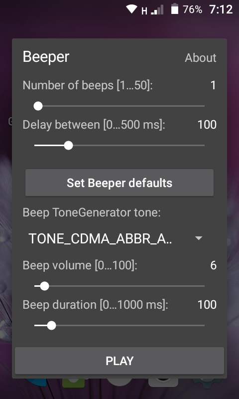

## Android Tone Player and Java Beeper class. MIT (c) 2022 @miktim

### Tone Player:  

  
  
Latest apk: [./beeper-app/v1/](./beeper-app/v1/)  

### Beeper:
Source: [./beeper/src/main/java/org/miktim/Beeper.java](./beeper/src/main/java/org/miktim/)  

#### Release notes:  
\- beeps are queued.  
#### package org.miktim;  
#### Class Beeper Methods:  
**static void beep()**;  
Defaults: TONE_CDMA_ABBR_ALERT, 75% volume, 100 milliseconds  
**static void beep(int volume)**;  
**static void beep(int volume, int durationMs)**;  
**static void beep(int toneType, int volume, int durationMs)**;  
Android ToneGenerator tones:  
https://developer.android.com/reference/android/media/ToneGenerator  
**static void pause(int durationMs)**;  
Play 'silence' (TONE_CDMA_SIGNAL_OFF)  
**static void cancel()**;  
Interrupts current sequence of beeps  
**static void await()**;  
Waiting for the completion of a sequence of beeps  
  
### See also:  
https://stackoverflow.com/questions/29509010/how-to-play-a-short-beep-to-android-phones-loudspeaker-programmatically  

https://stackoverflow.com/questions/11964623/audioflinger-could-not-create-track-status-12  
